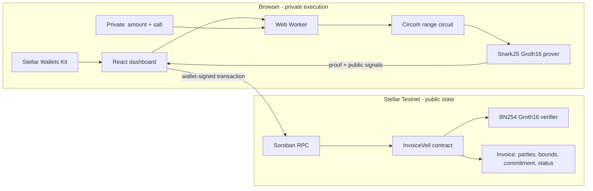
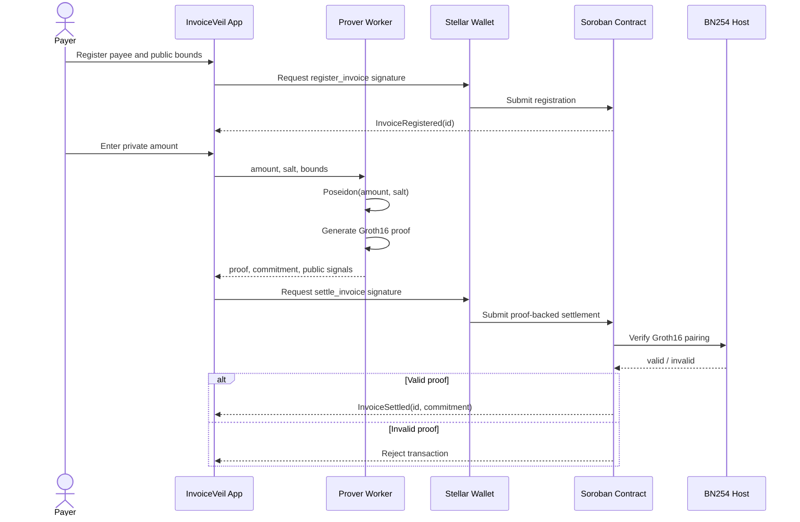

# InvoiceVeil

> Proof-gated private invoice settlement on Stellar.

InvoiceVeil lets a business register public invoice bounds, keep the exact amount private, and settle the invoice only when a Groth16 proof confirms that the hidden amount falls inside the agreed range. The proof is generated in the browser and verified by a Soroban contract using Stellar's native BN254 host functions.

## Why It Matters

Public ledgers expose negotiated prices, discounts, and commercial relationships. InvoiceVeil keeps the exact amount and its random salt off-chain while publishing only the parties, agreed bounds, Poseidon commitment, proof, and settlement status.

ZK is load-bearing: `settle_invoice` cannot mark an invoice as settled unless `verify_groth16` succeeds. Removing the verifier breaks the core authorization rule rather than merely removing a privacy badge.

## Demo Deployment

| Item | Value |
| --- | --- |
| Network | Stellar Testnet |
| Contract | `CALOHKUYNCYIPPICYZMDALGKV2V7QHADOXZGH3MIQQ5CR2WTD45OC5VI` |
| Fresh-proof settlement | [`63e12887...c1fc3`](https://stellar.expert/explorer/testnet/tx/63e12887d23eb90256db37fd7cd3726cc7b8827bf544fb91467ade85172c1fc3) |
| License | MIT |

The linked transaction settled invoice `#6` using a newly generated proof. Invalid proofs fail during Soroban simulation and are not broadcast.

## Architecture



## Settlement Flow



## Privacy Model

| Data | Visibility |
| --- | --- |
| Exact invoice amount | Browser only |
| Random salt | Browser only |
| Lower and upper bounds | Public |
| Payer and payee | Public |
| Poseidon commitment | Public |
| Groth16 proof | Submitted for contract verification |
| Settlement status | Public |

The circuit enforces:

```text
lo_bound <= amount <= hi_bound
commitment = Poseidon(amount, salt)
```

Its public signal order is `[lo_bound, hi_bound, commitment]`. Proof G2 coordinates are converted from SnarkJS into Soroban's `x.c1 | x.c0 | y.c1 | y.c0` BN254 encoding before submission.

## Repository

```text
circuits/   Circom range and Poseidon commitment circuits
contract/   Rust Soroban invoice state machine and Groth16 verifier
prover/     Proof generation, signal formatting, and Stellar SDK client
frontend/   React, Vite, Web Worker, and Stellar Wallets Kit application
scripts/    Circuit setup, deployment, payload, and smoke-test scripts
test/       Circuit, contract, and end-to-end test harnesses
```

### Invoice IDs

Invoice IDs are 1-based: the first invoice minted by `register_invoice` is `#1`, and the demo/local fallback assigns the same first ID. `next_id` in `contract/src/lib.rs` increments the stored counter before returning it.

## Run Locally

### Prerequisites

- Node.js 20+
- Rust and the `wasm32v1-none` target
- Circom 2.x
- Stellar CLI
- Freighter or another wallet supported by Stellar Wallets Kit

### Install and start

```bash
npm install
npm --prefix frontend install
copy frontend\.env.example frontend\.env
npm --prefix frontend run start
```

Open `http://localhost:3000`. Live mode requires a funded Stellar testnet wallet. Connecting redirects to `/dashboard`; disconnecting returns to the landing page, and the dashboard route is guarded without an active wallet session.

### Build and test

```bash
npm --prefix frontend run type-check
npm --prefix frontend run build
npm run test:e2e
cd contract
cargo test
```

`test:e2e` is a deterministic local integration harness. The deployment table separately records the real testnet proof settlement.

## Use The App

1. Connect a supported Stellar testnet wallet.
2. Register an invoice with a valid payee address and public lower/upper bounds.
3. Open **Settle**, select the pending invoice, and enter the private amount.
4. Wait for the Web Worker to generate the Groth16 proof.
5. Approve the Soroban transaction in the wallet.
6. Confirm the invoice appears as settled without exposing the exact amount.
7. Retain the displayed salt privately if later selective disclosure is required.

## Tech Stack

- Circom 2, circomlib, Poseidon, Groth16, and SnarkJS
- Rust, Soroban SDK, and Stellar BN254 host functions
- React 18, TypeScript, Vite, and Web Workers
- Stellar SDK and Stellar Wallets Kit
- Stellar Testnet and Soroban RPC

## Current Scope

This is a hackathon-grade testnet implementation, not audited production software.

- Settlement currently updates the invoice state after proof verification; it does **not** transfer USDC yet.
- Auditor disclosure is checked client-side because the deployed contract's `verify_disclosure` method does not yet recompute Poseidon on-chain.
- The dashboard tracks known invoice IDs locally instead of using a production indexer.
- The Groth16 setup is suitable for demonstration; production requires a dedicated multi-party ceremony and security review.
- Proof generation adds a large browser payload and can take several seconds on lower-powered devices.
- The application is testnet-only and must not be used with real funds.

## Roadmap

- Add atomic Stellar Asset Contract USDC transfer after proof verification.
- Implement on-chain Poseidon disclosure verification.
- Add an event indexer for multi-device invoice discovery.
- Add fixture-backed negative contract tests and independent security review.
- Optimize and lazy-load proving dependencies.
- Run a production trusted setup ceremony.

## References

- [ZK proofs on Stellar](https://developers.stellar.org/docs/build/apps/zk)
- [Stellar Groth16 verifier example](https://github.com/stellar/soroban-examples/tree/main/groth16_verifier)
- [Stellar Wallets Kit](https://stellarwalletskit.dev)
- [Circom documentation](https://docs.circom.io)
- [SnarkJS](https://github.com/iden3/snarkjs)

## License

[MIT](LICENSE)
